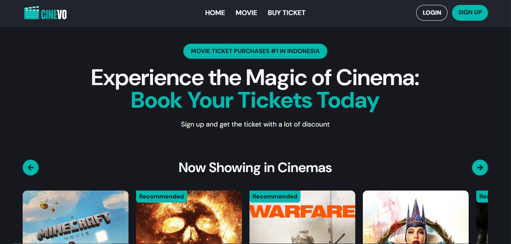

# CINEVO App

<!-- This project is a Movie Ticket project -->

## Preview



## How To Run This Project

Clone this project url :

``` https://github.com/VsalCode/fgo24-Tickitz.git ```

after entering the folder, install the dependencies:

```npm install```

To run the web you can use the command :

```npm run dev```

##  dependencies used
- Vite + React
- Tailwind CSS
- React Router DOM
- React Icons
- React Hook Form
- React Hook Form Resolvers
- React Hot Toast
- Redux Toolkit
- Redux Persist

## How To Contribute

Pull requests are welcome. For major changes, please open an issue first to discuss what you would like to change.

Please make sure to update tests as appropriate.

## License

[ISC](https://opensource.org/license/isc-license-txt)
