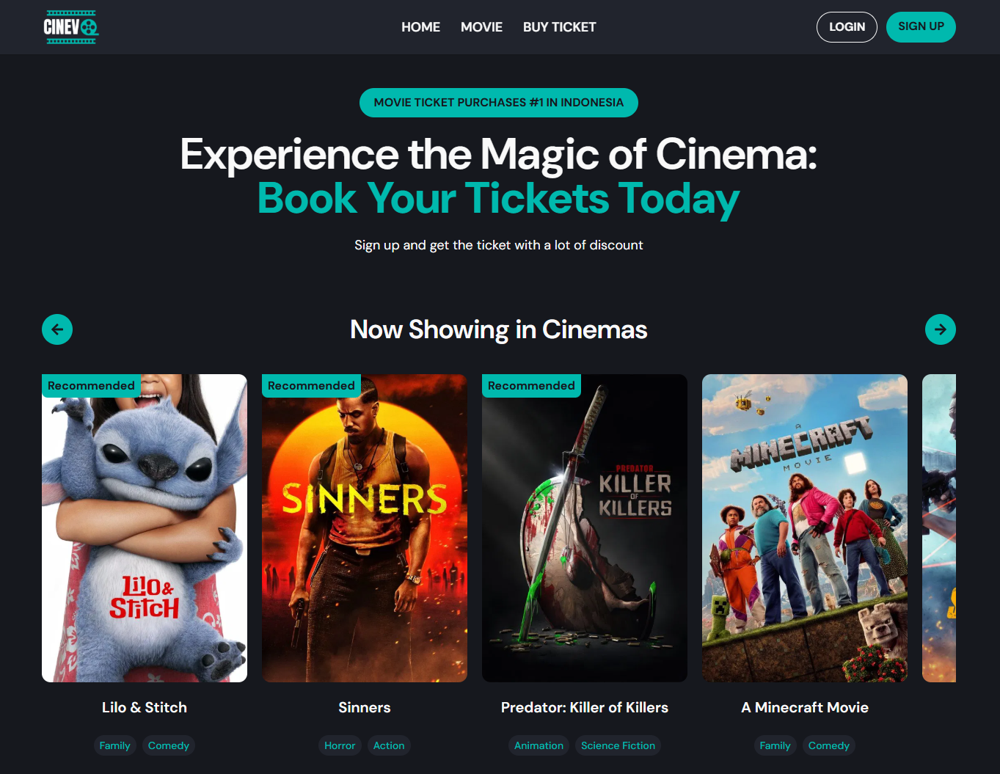

# 🎬 CINEVO — Movie Ticket Booking App

A modern movie ticket booking web app built with React, Vite, and Tailwind CSS. This application offers a seamless experience with support for dual login roles: Admin and User. Admins have the ability to add and edit movies, while all users can edit their personal information, browse movies, book tickets, and view their ticket booking history. Additionally, the app ensures data persistence using Redux Persist, allowing users to retain their preferences and booking details across sessions.

## 📸 Preview


## 🚀 How to Run This Project

*****Note:***** This project uses a .env file for environment variables, which is included in the .gitignore to prevent sensitive information from being exposed. Create a .env file in the root directory and configure the required environment variables (e.g., API keys) based on the provided .env.example file or project documentation.

#### # Run Locally (with Node.js) 💻
1. Clone the repository:
   ```bash
   git clone https://github.com/VsalCode/fgo24-react-cinevo.git
   ```
2. Navigate to the project folder:
   ```bash
   cd fgo24-react-cinevo
   ```
3. Install dependencies:
   ```bash
   npm install
   ```
4. Run the development server:
   ```bash
   npm run dev
   ```
5. Open your browser and visit `http://localhost:5173` (or the port shown in the terminal).

#### # Run with Docker 🐳 
Make sure you have Docker installed and running

1. Clone the repository:
   ```bash
   git clone https://github.com/VsalCode/fgo24-react-cinevo.git
   ```
2. Navigate to the project folder:
   ```bash
   cd fgo24-react-cinevo
   ```
3. Build the Docker image:
   ```bash
   docker build -t ghcr.io/vsalcode/cinevo:latest .
   ```
4. Run the Docker container:
   ```bash
   docker run -p 8080:80 -d ghcr.io/vsalcode/cinevo:latest
   ```
5. Visit the app at `http://localhost:8080`.

## 📦 Dependencies Used
- Vite + React
- Tailwind CSS
- React Router DOM
- React Icons
- React Hook Form
- React Hook Form Resolvers
- React Hot Toast
- Redux Toolkit
- Redux Persist
- React Google Chart

## 🤝 How to Contribute
Pull requests are welcome! For major changes, please open an issue first to discuss your proposed changes. Ensure tests are updated as needed.

## 📜 License
[MIT](https://opensource.org/license/mit)